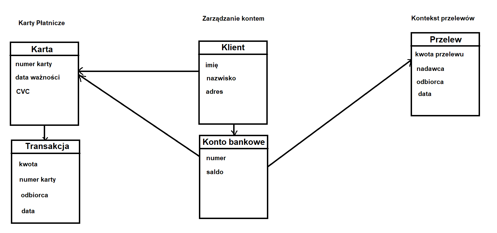

### 1. Opis zadania

Pierwsze zadanie polega na zaprojektowaniu części bezpiecznej aplikacji bankowej, stosując zasady **Domain Driven Design (DDD)**, z naciskiem na wybrany fragment systemu. W ramach zadania zdefiniowane zostały stosowne konteksty, operacje pomiędzy wyszczególnionymi kontekstami. Dodatkowo wypisane również zostały agregaty, encje i obiekty wartości.

---

### 2. Definiowanie Bounded Context

W wybranym przeze mnie fragmencie systemu bankowego można wyróżnić następujące konteksty:

- **Kontekst Zarządzania Kontem** - tworzenie, aktualizacja i usuwanie kont bankowych oraz zarządzanie ich atrybutami.
- **Kontekst Kart Płatniczych**  - obsługuje procesy związane z wydawaniem, aktywacją, blokowaniem i zarządzaniem kartami płatniczymi. Może też obejmować transakcje kartowe i zarządzanie limitami kart.

- **Kontekst Przelewów** - odpowiada za obsługę przelewów bankowych i płatności. Dotyczy procesów związanych z przesyłaniem środków między kontami (wewnątrz banku lub do innych banków) oraz harmonogramami płatności cyklicznych.
---

### 3. Modelowanie Agregatów, Encji i Obiektów Wartości

#### Agregaty:

- **Konto bankowe** - Agregat, który reprezentuje dane pojedynczego przelewu bankowego. 

- **Przelew** - Agregat, który reprezentuje dane pojedynczego przelewu bankowego.
- **Karty płatnicze** - Agregat, który przechowuje dane dotyczące karty płatniczej

#### Encje:

- **Konto bankowe**  
- **Przelew**
- **Klient**
- **Karta**
- **Transakcja**  
 

#### Obiekty Wartości:

- **Adres**
  - Zawiera szczegóły dotyczące adresu klienta, takie jak ulica, miasto, kod pocztowy.

- **Kwota przelewu**
  - Reprezentuje kwotę przelewu oraz jej walutę, wraz z weryfikacją poprawności kwoty.

 - **Dane kontaktowe**
	  - Zawiera szczegóły dotyczące sposobów kontaktu z klientem - jego adres email oraz numer telefonu.

---

### 4. Przyjęte założenia

Poniżej znajdują się opisy atrybutów oraz założenia ich dotyczące:

1. **Numer karty** – unikalny numer identyfikacyjny karty płatniczej.
   - Ograniczenia: 16 cyfr bez spacji (np. `1234567812345678`), typu `STRING` lub `INTEGER`.

2. **Data ważności** – data, do której karta jest ważna.
   - Ograniczenia: format `MM/RR` (np. `12/25`), typu `STRING` lub `DATE`.

3. **CVC** – trzycyfrowy kod zabezpieczający znajdujący się na odwrocie karty.
   - Ograniczenia: 3 cyfry, typu `STRING` lub `INTEGER`, zakres od `100` do `999`.

4. **Kwota** – wartość pieniężna transakcji lub salda.
   - Ograniczenia: liczba z maksymalnie dwoma miejscami po przecinku (np. `1500.00`), typu `DECIMAL` lub `FLOAT`, wartość dodatnia lub zerowa.

5. **Odbiorca** – imię i nazwisko lub nazwa podmiotu, do którego skierowany jest przelew.
   - Ograniczenia: tekst do 100 znaków, typu `STRING`, tylko litery i spacje.

6. **Data** – data wykonania operacji, np. przelewu.
   - Ograniczenia: format `RRRR-MM-DD` (np. `2024-12-31`), typu `DATE`.

7. **Imię** – imię właściciela konta lub nadawcy.
   - Ograniczenia: tekst do 50 znaków, typu `STRING`, tylko litery i ewentualnie znaki diakrytyczne.

8. **Nazwisko** – nazwisko właściciela konta lub nadawcy.
   - Ograniczenia: tekst do 50 znaków, typu `STRING`, tylko litery i ewentualnie znaki diakrytyczne.

9. **Adres** – pełny adres zamieszkania lub korespondencyjny.
   - Ograniczenia: tekst do 200 znaków, typu `STRING`, format zależny od kraju (zazwyczaj ulica, numer domu, kod pocztowy, miasto).

10. **Numer konta** – unikalny numer identyfikacyjny konta bankowego.
    - Ograniczenia: 26 cyfr dla polskiego IBAN-u (np. `PL60102010260000042270201111`), typu `STRING`.

11. **Saldo** – aktualna dostępna kwota na koncie.
    - Ograniczenia: liczba z maksymalnie dwoma miejscami po przecinku (np. `1000.00`), typu `DECIMAL` lub `FLOAT`, wartość zerowa lub dodatnia.

12. **Kwota przelewu** – wartość pieniężna przelewu, który ma być zrealizowany.
    - Ograniczenia: liczba z maksymalnie dwoma miejscami po przecinku (np. `250.50`), typu `DECIMAL` lub `FLOAT`, większa od zera.

13. **Nadawca** – imię i nazwisko lub nazwa podmiotu, który realizuje przelew.
    - Ograniczenia: tekst do 100 znaków, typu `STRING`, tylko litery i spacje.

### 5. Diagram modelu

Diagram modelu przedstawia wszystkie wymienione encje oraz obiekty wartości. Zdefiniowane są trzy konteksty: zarządzanie kontem, kontekst przelewów i karty płatnicze.

---